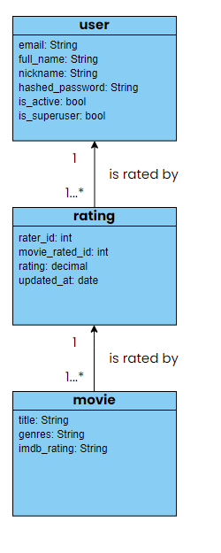

# Estrutura de arquivos

```
├── .env                                                    # variáveis de ambiente
├── docker-compose.yaml                                     # contem definicoes das imagens do backend e do postgreSQL
├── docker-compose.override.yaml                            # arquivo para redefinir configs padrão do compose e setar um ambiente dev
├── docs                                                    # contem descrições sobre o projeto
├── movie-app                                               # pasta do app
│   ├── Dockerfile                                          # imagem do backend
│   ├── alembic.ini                                         # config das migrations
│   ├── lib                                                 # códigos reusáveis pelos 3 módulos (recommendation, src, test)
│   ├── recommendation                                      # sistema de recomendação
│   ├── src                                                 # src da api
│   │   ├── alembic                                         # migrations
│   │   ├── core                                            # domínio principal do app
│   │   │   └── v1                                          # versionamento da api
│   │   │       ├── routes.py                               # agregador das rotas do app
│   │   │       ├── auth    [...]                           # subdomínio relacionado a auth
│   │   │       ├── movies  [...]                           # subdomínio relacionado aos filmes
│   │   │       ├── ratings [...]                           # subdomínio relacionado as avaliações
│   │   │       ├── recommendation                          # subdomínio relacionado às recomendações
│   │   │       │   ├─── ml                                 # pasta relacionada ao machine learning
│   │   │       │   │   ├─── feature_eng_model.joblib       # modelo pré-treinado (ao rodar o training.py ele gera esse arquivo)
│   │   │       │   │   ├─── feature_engineering.ipynb      # contem o estudo para realizar as recomendações
│   │   │       │   │   ├─── predict.py                     # contem as funções chamadas pela API para fazer o predict
│   │   │       │   │   └──  training.py                    # realiza o treino do modelo e salva um feature_eng_model.joblib
│   │   │       │   └── utils.py                            # funcoes utilitarias de ml usadas tanto no estudo quando no script de geracao
│   │   │       └── users                                   # subdomínio relacionado aos usuarios
│   │   │           ├── deps.py                             # dependencias do router (validações)
│   │   │           ├── exceptions.py                       # exceções especificas do modulo
│   │   │           ├── models.py                           # models do database
│   │   │           ├── router.py                           # contém as rotas do modulo
│   │   │           ├── schemas.py                          # models do pydantic
│   │   │           └── service.py                          # business logic do model
│   │   ├── infrastructure                                  # configs do app (db, security, fastAPI, etc)
│   │   ├── lib                                             # códigos reusáveis pelos módulos da api
│   │   ├── main.py                                         # arquivo de entrada do FastAPI
│   │   ├── prestart.sh                                     # arquivo necessário que é usado como [entrypoint](https://docs.docker.com/reference/dockerfile/#entrypoint) da imagem
│   │   └── tests                                           # unit tests
|   │           [...]
│   │           └── tests-start.sh                          # arquivos para configurar o ambiente de teste
│   └── scripts                                             # pasta auxiliar para scripts (parecido com a sessão scripts do package.json)
│           ├───py
│               ├── format.sh
│           └───unix
│               ├── format.sh
│               ├── lint.sh
│               ├── prestart.sh
│               └── tests-start.sh
└── pyproject.toml                                          # definicao do env para o [Poetry](https://python-poetry.org/docs/pyproject/)
```

# Database



# teoria do sistema de recomendação

[estudo feito](../movie-app/api/core/v1/recommendation/ml/feature_engineering/feature_engineering.ipynb)

## links

- https://medium.com/intro-to-artificial-intelligence/recommendation-engine-algorithm-content-based-filtering-92297632e77f
